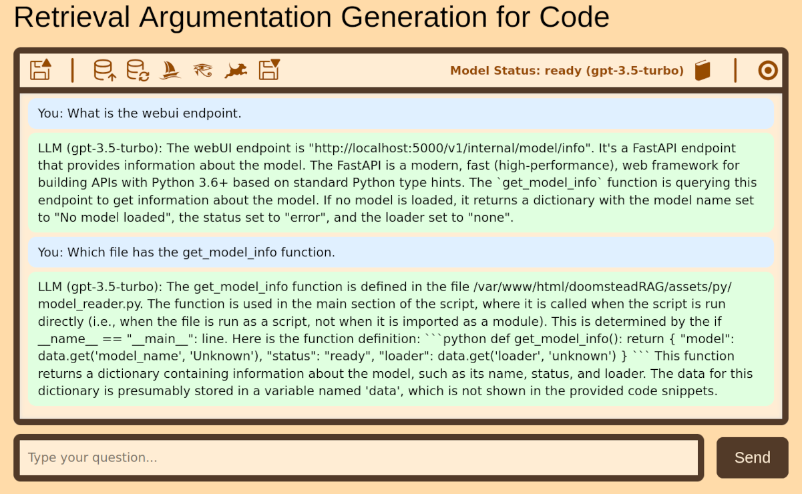

# Doomstead RAG
A code assistant.

# Requirements

This local web app requires the Text generation web UI server to be running.

    python3 server.py --listen --api --trust-remote-code \

This launches a command window :

    Activating virtual environment...
    Checking system requirements...
    Initializing system...
    Starting server...
    11:02:30-480139 INFO     Starting Text generation web UI                        
    11:02:30-483014 WARNING  trust_remote_code is enabled. This is dangerous.       
    11:02:30-483764 WARNING                                                         
                             You are potentially exposing the web UI to the entire  
                             internet without any access password.                  
                             You can create one with the "--gradio-auth" flag like  
                             this:                                                  
                                                                                
                             --gradio-auth username:password                        
                                                                                
                             Make sure to replace username:password with your own.  
    11:02:30-491511 INFO     Loading the extension "openai"                         
    11:02:30-577386 INFO     OpenAI-compatible API URL:                             
                                                                                
                             http://0.0.0.0:5000  

# Operation

Understanding the Operation of the RAG System

The Retrieval-Augmented Generation (RAG) system described here integrates a clean, interactive web interface with a backend pipeline that connects to a local Large Language Model (LLM). It is designed to allow users to ask technical questions about code by combining semantic search with generative AI. The system builds a context from code snippets stored in a rudimentary vector store and augments user queries with this context before sending it to the model. This essay outlines the system’s architecture and workflow, covering its frontend UI, JavaScript behavior, PHP backend logic, and the basic RAG process.
1. Frontend Interface (HTML/CSS/JavaScript)

The user interface is styled using rag.css, which establishes a clean layout with a readable font and distinct visual separation between user and bot messages. The chatbox shows past interactions, and messages are visually styled to indicate the sender (user or LLM). The status bar at the top reflects the current state of the LLM—whether it is loaded and ready.

In rag.js, event listeners handle user interaction. When the page loads, checkModelStatus() continuously polls the backend until it confirms that a model is loaded. Once the model is ready, the input field and send button are enabled, allowing the user to type a question.

When the user submits a message:

    The input is temporarily disabled.

    A visual copy of the user's message is added to the chat.

    A POST request is made to assets/php/rag.php with the message.

    The response from the server (LLM output) is then displayed in the chatbox.

This asynchronous messaging structure ensures a smooth conversational experience.
2. Backend Logic (PHP)

The core intelligence of the system lies in rag.php, which acts as the bridge between the frontend and the model. The file defines a RAGSystem class that encapsulates the major components of the pipeline:

    Model Status Checking:
    The is_model_ready() and wait_for_model_ready() methods poll the local LLM (via the /models endpoint) to confirm availability before answering any queries. This ensures the user cannot send messages before the backend is prepared.

    RAG Context Assembly:
    The vector store is currently a hardcoded PHP array called $RAG_VECTOR_STORE, containing code snippets and metadata (document ID, file path, function name). The build_rag_context() method composes a contextual string by concatenating all entries in the vector store. This string forms the foundation for the LLM prompt.

    Query Processing:
    When a user sends a message, the PHP script builds the full prompt by combining:

        The constructed context from the vector store.  <-- display constructed context button

        Instructions to extract specific metadata from the code (purpose, HTML ID, CSS class, function name).

        The user’s query.

    The complete prompt is sent to the model via the /chat/completions API endpoint with a structured payload, including temperature and max token settings. The model’s response is then sent back to the frontend in JSON format.

    Error Handling and Logging:
    All backend operations log events to the PHP error log for debugging, including model readiness checks and context construction.

3. LLM Integration and Prompt Engineering

The system communicates with a locally running LLM API via HTTP. The prompt is specifically engineered to focus the LLM’s attention on PHP code analysis, asking it to extract clear, structured metadata. The use of temperature 0.3 and a stop token (\nFunction:) constrains the generation to more deterministic, concise responses.
4. Vector Store Building (Planned / Placeholder)

A GET endpoint (?action=build_vectorstore) is stubbed out to simulate the triggering of a background Python process that would build a real vector store. While not yet implemented, this is a forward-looking placeholder for future functionality that might involve semantic indexing, chunking, and embedding generation.
5. Current Limitations and Design Considerations

The system is still in its early stages, with several simplifications:

    The vector store is static and hardcoded.

    No real semantic search or similarity ranking is done yet.

    The prompt relies on template-style context concatenation rather than context-aware chunk selection.

    Error feedback is mostly logged, not shown in the UI.

However, these limitations also demonstrate clear modularity. The system is structured such that vector store improvements, embedding-based retrieval, or even model switching can be integrated cleanly.
