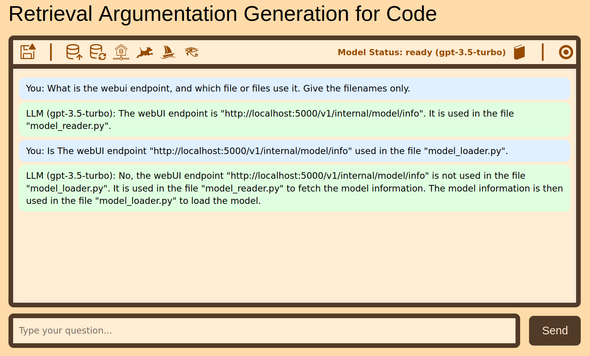

# Doomstead RAG
A code assistant.

* The second result is not absolutely correct, but rhymes with it.

# Requirements

This local web app requires 'oobabooga' [text-generation-webui](https://github.com/oobabooga/text-generation-webui).  

configure oobabooga permissions on the server.py file and text-generation-webui/launch.log so that the 
web app can launch the server with the home server button.

A model also must be available to oobabooga server in the appropriate text-generation-webui folder.  
It can be loaded with the leaping dog. 

The sailboat verifies the model has been loaded.

# Operation

Understanding the Operation of the RAG System

The Retrieval-Augmented Generation (RAG) system described here integrates a clean, interactive web interface with a backend pipeline that connects to a local Large Language Model (LLM). 

This web app is designed to allow users to ask technical questions about application source code by combining semantic search with generative AI. The system builds a context from code snippets stored in a vector store created from the application source code and augments user queries with source code context before sending an enhanced query it to the loaded llm.  Simple formatting of results makes the results usefull. 

# Design

More documentation will be written as the project develops.  Basic operation is achieved.  Two code databases are 'available' under the floppy disk.  One of them is proprietary (mine) so I did not put the .yaml file for it in the archive.  The other database which can be selected is the source code for this application, and 'ragcode.yaml' specifies source code locations.  The application can examine it's own code.

Structurally application code javascript calls PHP.  PHP interfaces with python.
